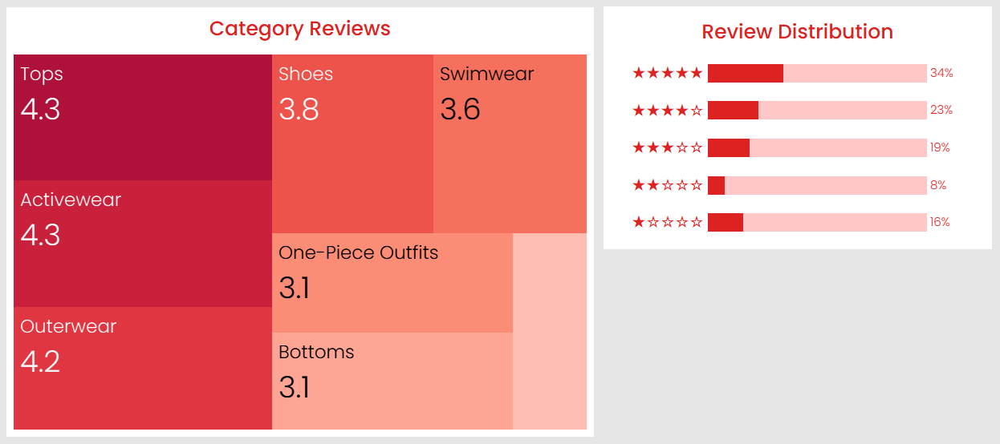

# Clothing-E-Commerce-Analytics-Mexico

## 📘 Background and Overview

This project presents a comprehensive analytics case study built entirely from scratch, simulating the behavior of a fictional clothing e-commerce platform operating in Mexico. The dataset was synthetically generated using advanced SQL logic in MySQL, incorporating probabilistic modeling, regional segmentation, and behavioral assumptions to emulate realistic consumer activity over a four-year period.

The goal was to create a robust foundation for exploratory and explanatory data analysis using Tableau, focusing on purchase patterns, demographic trends, and operational metrics. By controlling the data generation process, the project avoids the limitations of pre-cleaned or biased datasets, allowing for deeper insight into how data structure influences analytical outcomes.

Key dimensions such as age, gender, state, item category, payment method, and subscription status were modeled with intentional variability and noise, enabling the creation of dashboards that reflect real-world complexity. This approach not only showcases technical proficiency in data engineering and visualization, but also demonstrates how synthetic data can be used to simulate business intelligence workflows in environments where real data may be unavailable or sensitive.

### 🔗 Key Project Assets

- 📄 [Synthetic Data Generation Query](https://github.com/andrezrg/Clothing-E-Commerce-Analytics-Mexico/blob/main/e-commerce-clothing/sytnthtic-data-generator.sql)  
- 📊 [Analytical SQL Queries Used for Insight Extraction](https://github.com/andrezrg/Clothing-E-Commerce-Analytics-Mexico/blob/main/e-commerce-clothing/data-analysis-queries.sql)  
- 📈 [Interactive Tableau Dashboard](https://public.tableau.com/app/profile/andr.s.ram.rez.guill.n/viz/e-commerce-clothing/Dashboard?publish=yes)

## 🔍 Insights

The Tableau dashboard provides a multi-layered view of performance metrics, customer behavior, and product trends across Mexico's simulated e-commerce landscape. Below is a breakdown of the most impactful insights derived from the data:

### 🧮 Revenue and Order Trends
- **Total Revenue in 2024** reached $6,406,135.95 across **16,541 orders**, marking the highest annual performance in the dataset.
- **Year-over-year growth** in both revenue and order volume reflects consistent business expansion, while the **average review score** has remained stable at 3.5, suggesting a consistent customer experience.

### 📆 Seasonality and Monthly Performance
- Sales peaked in **September 2024** with $682,769.24 in revenue, followed by a sharp drop in Octuber, indicating strong summer demand and potential post-season fatigue.
- Monthly trends reveal cyclical behavior, useful for inventory planning and promotional timing.

### 🗺️ Regional Distribution

- **Ciudad de México**, **Estado de México**, **Jalisco**, **Veracruz**, **Puebla**, **Guanajuato**, and **Nuevo León** are leading in both revenue and order volume over the past four years, confirming their role as commercial hubs. Together, they account for **36% of total revenue**.
- The choropleth map highlights regional disparities, offering opportunities for targeted marketing in underperforming states.
- In contrast, the states with the **lowest sales performance in 2024** include **Chiapas**, **Nayarit**, **Baja California**, **Campeche**, **Colima**, **Quintana Roo**, and **Baja California Sur**, suggesting potential gaps in market penetration or regional engagement. These states represent only **13% of total revenue**.

### 👕 Product Popularity
- The **Top 10 Items** include staples like tank tops, hoodies, swim shorts, and jeans showing particularly high order counts.
- These trends suggest strong consumer interest in casual and activewear categories.

### 👤 Demographic Behavior
- The **24–27 age group** dominates order volume, followed by 20–23, confirming young adults as the primary customer base.
- Orders decline sharply in age groups above 50, indicating lower engagement among older demographics.

### 📦 Size and Gender Preferences
- **Size M and XL** are the most purchased across all genders, with female buyers showing higher volume overall.
- The pie charts reveal clear segmentation in size preferences, which can inform inventory allocation.

### 💳 Payment Type Preferences
- **Credit cards** account for 35.17% of all payments, followed by debit cards with 32.48%, then cash and PayPal remain marginal, and **bank transfers** being the least frequent.

### ⭐ Review Patterns
- Review distribution skews positively, with 4 and 5 star ratings making up the majority. Category-level ratings show **Tops** and **Activewear** as the highest-rated, while **Outwear** and **Shoes** trail behind.

These insights collectively offer a realistic simulation of e-commerce dynamics, enabling strategic decisions around product development, customer targeting, and operational planning.

## 🧭 Recommendations

Based on the insights extracted from the synthetic dataset and visualized in Tableau, the following strategic recommendations are proposed:

### 📈 Optimize Seasonal Campaigns
- Leverage peak months (especially summer) by launching targeted promotions and inventory boosts in June–September.
- Consider post-season retention strategies to mitigate the sales drop observed in October.

### 🗺️ Expand Regional Reach
- Focus marketing efforts on underperforming states such as Chiapas, Nayarit, and Campeche through localized campaigns, influencer partnerships, or regional discounts.
- Analyze barriers to entry in low-revenue regions to improve accessibility and engagement.

### 👤 Refine Customer Segmentation
- Prioritize the 20–27 age segment with tailored product bundles, loyalty programs, and UX optimizations geared toward younger shoppers.
- Explore strategies to engage older demographics, such as simplified navigation, targeted ads, or senior-friendly product lines.

### 👕 Adjust Inventory Strategy
- Increase stock for high-demand sizes (M and XL) and top-selling items like tank tops, hoodies, and swimwear.
- Use size and gender distribution data to inform regional warehouse allocation and reduce overstock.

### 💳 Enhance Payment Experience
- Promote credit and debit card usage with incentives, while exploring ways to improve trust and adoption of alternative methods like PayPal and bank transfers.
- Monitor payment friction points to reduce cart abandonment.

### ⭐ Maintain Review Quality
- Continue to monitor category-level ratings to identify product improvement opportunities.
- Encourage customer feedback through post-purchase incentives to maintain transparency and trust.

These recommendations are designed to simulate actionable strategies that a real e-commerce business could implement, using synthetic data as a proxy for real-world decision-making.
